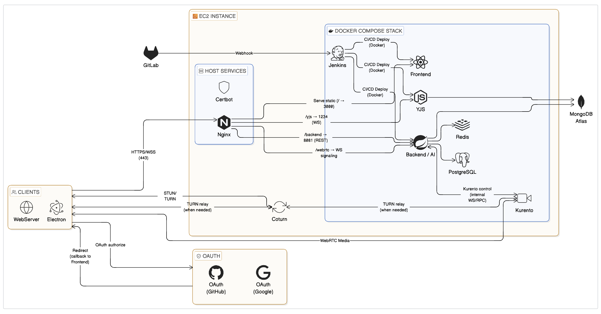
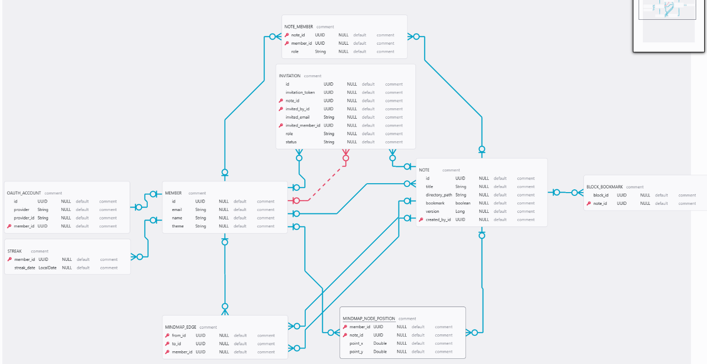

# SYNAPSE

> 코드 실행, AI 리뷰, 실시간 협업을 하나의 노트에서
> 개발자를 위한 학습 노트 플랫폼


## 프로젝트 소개

SYNAPSE는 개발자들이 학습 노트를 작성하면서 **코드를 즉시 실행**하고, **AI 리뷰**를 받으며, **실시간으로 협업**할 수 있는 통합 플랫폼입니다.

기존 노트 앱(Notion, Obsidian)은 코드 실행과 협업 기능이 부족했고, IDE는 학습 노트 작성에 적합하지 않았습니다. SYNAPSE는 이 두 가지를 결합하여 개발자 특화 학습 환경을 제공합니다.

### 주요 기능

- **코드 실행 엔진**: Docker 샌드박스에서 Python/JavaScript/Java 코드를 안전하게 실행
- **AI 코드 리뷰**: Claude, Gemini, OpenAI를 선택하여 코드 리뷰 및 요약 생성
- **실시간 협업**: Yjs CRDT 기반 동시 편집 및 충돌 자동 해결
- **세션 기반 REPL**: 같은 노트 내 코드 블록 간 변수/함수 공유
- **음성 채팅**: WebRTC(Kurento) 기반 팀 음성 커뮤니케이션
- **학습 통계**: 연속 학습 일수(Streak), 노트 작성 통계 시각화

---

## 기술 스택

### Backend

| Category | Technology |
| --- | --- |
| Framework | Spring Boot 3.5.9 |
| Language | Java 17 |
| Database | PostgreSQL 16 (메타데이터), MongoDB 8.0 (노트 블록), Redis 7.4 (토큰/캐시) |
| Security | Spring Security, JWT, OAuth 2.0 |
| WebRTC | Kurento 7.1.0 |
| Build | Gradle 8.8 |

### Frontend

| Category | Technology |
| --- | --- |
| Framework | React 18 |
| Language | TypeScript 5.4 |
| Desktop | Electron 30 |
| Real-time | Yjs 13.6, WebSocket |
| State | Zustand 5.0 |
| Charts | Recharts 2.12 |

### Infrastructure

| Category | Technology |
| --- | --- |
| Containerization | Docker 27.4, Docker Compose |
| Reverse Proxy | Nginx 1.25 |
| CI/CD | GitLab CI/CD |
| Monitoring | Prometheus, Grafana |

---

## 시스템 아키텍처



### 주요 설계 결정

1. **Hybrid DB Architecture**: PostgreSQL(관계형 메타데이터) + MongoDB(비정형 블록) + Redis(캐시)
2. **Electron IPC**: Main-Renderer 프로세스 분리로 보안 강화
3. **CRDT over OT**: 서버 부하 감소 및 오프라인 편집 지원
4. **Factory Pattern**: AI 프로바이더 추상화로 확장성 확보

---

## 데이터베이스 구조



---

## 설치 및 실행

### 필수 요구사항

- **Docker**: 27.0 이상
- **Docker Compose**: 2.20 이상
- **Node.js**: 20 LTS 이상
- **Java**: 17 이상
- **Gradle**: 8.8 이상

### 1. 환경 변수 설정

각 서비스별 `.env` 파일을 생성합니다.

#### Backend (`BE/api/.env`)

```env
# Database
DB_URL=jdbc:postgresql://localhost:5432/synapse
DB_USERNAME=postgres
DB_PASSWORD=your_password

# JWT
JWT_SECRET=your-256-bit-secret-key
JWT_ISSUER=synapse

# OAuth 2.0
GOOGLE_CLIENT_ID=your-google-client-id
GOOGLE_CLIENT_SECRET=your-google-client-secret
GITHUB_CLIENT_ID=your-github-client-id
GITHUB_CLIENT_SECRET=your-github-client-secret

# AI Providers
CLAUDE_API_KEY=your-claude-api-key
GEMINI_API_KEY=your-gemini-api-key
OPENAI_API_KEY=your-openai-api-key

# AWS S3
AWS_ACCESS_KEY=your-aws-access-key
AWS_SECRET_KEY=your-aws-secret-key
AWS_REGION=ap-northeast-2
AWS_BUCKET_NAME=your-bucket-name
```

#### Frontend (`FE/.env`)

```env
VITE_API_URL=http://localhost:8080
VITE_WS_URL=ws://localhost:3001
```

### 2. Docker 컨테이너 실행

```bash
# PostgreSQL, MongoDB, Redis 실행
docker-compose up -d
```

### 3. Backend 실행

```bash
cd BE/api
./gradlew bootRun
```

서버가 `http://localhost:8080`에서 실행됩니다.

### 4. Yjs Server 실행

```bash
cd yjs-server
npm install
npm run dev
```

Yjs WebSocket 서버가 `ws://localhost:3001`에서 실행됩니다.

### 5. Frontend (Electron) 실행

```bash
cd FE
npm install
npm run dev
```

Electron 앱이 실행됩니다.

---

## 사용자 흐름도

### 1. 회원가입 및 로그인

```text
[앱 실행] → [로그인 화면]
                │
                ├─→ [Google 로그인] → [OAuth 인증] → [JWT 토큰 발급]
                │                                           │
                └─→ [GitHub 로그인] → [OAuth 인증]  ──────────┤
                                                            │
                                                            ▼
                                            [메인 대시보드 진입]
                                                            │
                                                            ├─→ [내 노트 목록]
                                                            ├─→ [공유받은 노트]
                                                            └─→ [학습 통계]
```

### 2. 노트 작성 및 코드 실행 흐름

```text
[노트 생성] → [에디터 진입]
                    │
                    ├─→ [텍스트 블록 추가] → [마크다운 작성]
                    │
                    ├─→ [코드 블록 추가] → [언어 선택 (Python/JS/Java)]
                    │           │
                    │           ├─→ [Single 모드] → [실행 버튼 클릭]
                    │           │         │
                    │           │         └─→ [Docker 컨테이너 생성] → [코드 실행] → [결과 표시]
                    │           │
                    │           └─→ [Session 모드] → [실행 버튼 클릭]
                    │                     │
                    │                     └─→ [기존 세션 재사용] → [즉시 실행 (0.1초)] → [결과 표시]
                    │
                    └─→ [이미지 블록 추가] → [S3 업로드] → [Presigned URL 표시]
```

### 3. AI 코드 리뷰 흐름

```text
[코드 블록 선택] → [AI 리뷰 버튼 클릭]
                        │
                        ├─→ [프로바이더 선택]
                        │       │
                        │       ├─→ [Claude Sonnet 4.5]
                        │       ├─→ [Gemini 2.0 Flash]
                        │       └─→ [GPT-4o]
                        │
                        ▼
                [리뷰 타입 선택]
                        │
                        ├─→ [코드 리뷰] → [AI API 호출] → [개선점 및 버그 분석 표시]
                        │
                        ├─→ [코드 요약] → [AI API 호출] → [코드 설명 생성]
                        │
                        └─→ [선택 영역 질문] → [질문 입력] → [AI 응답 표시]
```

### 4. 실시간 협업 흐름

```text
[노트 소유자]                           [초대받은 사용자]
      │                                       │
      ├─→ [초대 버튼 클릭]                      │
      │                                       │
      ├─→ [권한 선택]                          │
      │    (OWNER/EDITOR/VIEWER)              │
      │                                       │
      ├─→ [초대 링크 생성]                      │
      │                                       │
      ├─→ [링크 공유] ──────────────────────→ [링크 수신]
      │                                       │
      │                                       └─→ [링크 클릭]
      │                                                │
      │                                                ├─→ [권한 확인]
      │                                                │
      │                                                └─→ [노트 접근 승인]
      │                                                         │
      ├─────────────────────────────────────────────────────────┤
      │                                                         │
      ├─→ [WebSocket 연결]                     [WebSocket 연결] ←┤
      │                                                         │
      ├─→ [Yjs CRDT 동기화]                    [Yjs CRDT 동기화] ←┤
      │                                                         │
      ├─→ [블록 편집] ─────────────────────→     [실시간 반영]     │
      │                                        (50ms 이내)       │
      │                                                         │
      │   [실시간 반영] ←───────────────────────── [블록 편집] ────┤
      │   (충돌 자동 해결)                                        │
      │                                                         │
      └─→ [커서 위치 공유] ←─────────────→ [다른 사용자 커서 표시]
```

### 5. 세션 기반 REPL 변수 공유

```text
[노트 에디터]
    │
    ├─→ [코드 블록 #1] → [변수 선언: x = 10]
    │         │
    │         └─→ [Session 실행] → [Python 세션 생성]
    │                                      │
    │                                      └─→ [변수 x 메모리 저장]
    │
    ├─→ [코드 블록 #2] → [변수 사용: print(x)]
    │         │
    │         └─→ [Session 실행] → [기존 세션 재사용]
    │                                      │
    │                                      └─→ [출력: 10]
    │
    ├─→ [코드 블록 #3] → [함수 정의: def add(a, b)]
    │         │
    │         └─→ [Session 실행] → [함수 메모리 저장]
    │
    └─→ [코드 블록 #4] → [함수 호출: add(5, 3)]
              │
              └─→ [Session 실행] → [출력: 8]
```

### 6. 음성 채팅 흐름

```text
[사용자 A]                              [사용자 B]
    │                                       │
    ├─→ [음성 채팅 버튼 클릭]                  │
    │                                       │
    ├─→ [WebRTC 연결 요청]                   │
    │         │                             │
    │         └──────────→ [Kurento 서버] ←──┼─→ [연결 수락]
    │                            │                    │
    ├─→ [마이크 권한 허용]         │                    ├─→ [마이크 권한 허용]
    │                            │                    │
    ├─→ [음성 스트림 전송] → [Kurento] ←────────────────┼─→ [음성 스트림 전송]
    │                            │                    │
    │   [실시간 음성 수신] ←───────┴────────────→ [실시간 음성 수신]
    │                                                 │
    └─→ [채팅 종료] ──────────────────────────────→ [연결 해제]
```

---

## 주요 기능

### 1. Docker 샌드박스 코드 실행

- **7중 보안 정책**: CPU 제한, 메모리 제한, 네트워크 격리, Read-only 파일시스템, PID 제한, tmpfs, no-new-privileges
- **지원 언어**: Python 3.11, JavaScript (Node 20), Java 17
- **실행 타임아웃**: 5초 (기본), 10초 (Single 모드)
- **리소스 제한**: CPU 1.0코어, 메모리 512MB, PID 50개

### 2. 세션 기반 REPL

- **변수 공유**: 같은 노트 내 코드 블록 간 변수/함수 공유
- **세션 재사용**: 컨테이너 재생성 없이 즉시 실행 (20~30배 속도 향상)
- **endMarker 패턴**: 50ms 폴링으로 실행 완료 감지
- **자동 정리**: 30분 유휴 시 세션 자동 종료 (5분 주기 체크)

### 3. AI 멀티 프로바이더

- **지원 모델**: Claude Sonnet 4.5, Gemini 2.0 Flash, GPT-4o
- **기능**: 코드 리뷰, 코드 요약, 선택 영역 질문
- **Factory/Strategy 패턴**: 새 프로바이더 추가 시 1개 클래스만 구현

### 4. 실시간 협업 (Yjs CRDT)

- **CRDT 알고리즘**: 충돌 자동 해결, 서버 부하 최소화
- **Awareness**: 실시간 사용자 커서 및 상태 공유
- **오프라인 지원**: 네트워크 단절 시에도 로컬 편집 가능, 재접속 시 자동 병합
- **변경 효율**: 전체 문서가 아닌 변경 부분만 전송

### 5. 노트 초대 시스템

- **2-Step 초대**: 초대 링크 생성 → 수신자 수락
- **권한 관리**: OWNER, EDITOR, VIEWER 3단계 권한
- **JWT 티켓**: 60초 TTL WebSocket 인증
- **초대 만료**: 시간 기반 초대 링크 만료

---

## 성능 지표

| 기능 | 개선 내용 | 수치 |
| --- | --- | --- |
| 세션 코드 실행 | 컨테이너 재사용 | 2~3초 → 0.1초 (20~30배 향상) |
| endMarker 폴링 | 실행 완료 감지 | 50ms 간격, 평균 50~150ms 응답 |
| Docker 리소스 | 보안 샌드박스 | CPU 1.0코어, 메모리 512MB, PID 50개 |
| JWT 토큰 | 세션 관리 | Access 1시간, Refresh 14일 |
| WebSocket 티켓 | 실시간 인증 | TTL 60초 |
| 세션 유휴 정리 | 메모리 효율 | 30분 유휴 시 자동 종료 (5분 주기 체크) |

---

## 보안

- **OAuth 2.0**: Google, GitHub 소셜 로그인
- **JWT**: Access Token (1시간) + Refresh Token (14일)
- **Docker 샌드박스**: 네트워크 격리, 리소스 제한, Read-only 파일시스템
- **CORS**: Origin 기반 접근 제어
- **XSS/CSRF**: Spring Security 기본 방어

---

## 팀원소개

SSAFY 14기 자율 프로젝트 B102_팀 대쫀쿠

- [이재영](woduddl1000@gmail.com): 팀장, 풀스택
- [양수영](ysw1mst@naver.com): 풀스택, 디자인
- [김동현](dosl196122@naver.com): 프론트
- [이상협](7176ryu@naver.com): 프론트
- [임지민](10jmin04@naver.com): 백엔드, 인프라
- [조서림](srcho425@gmail.com): 백엔드
